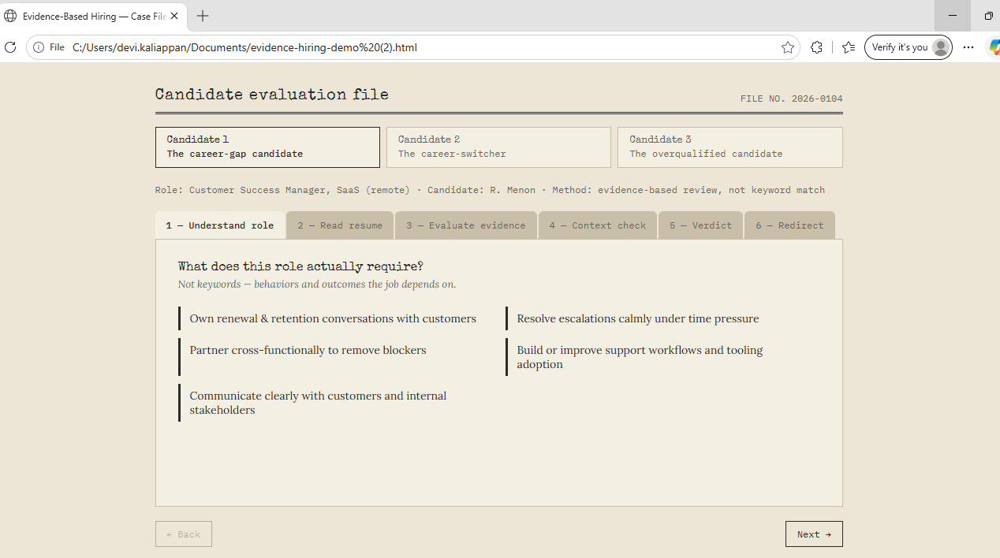
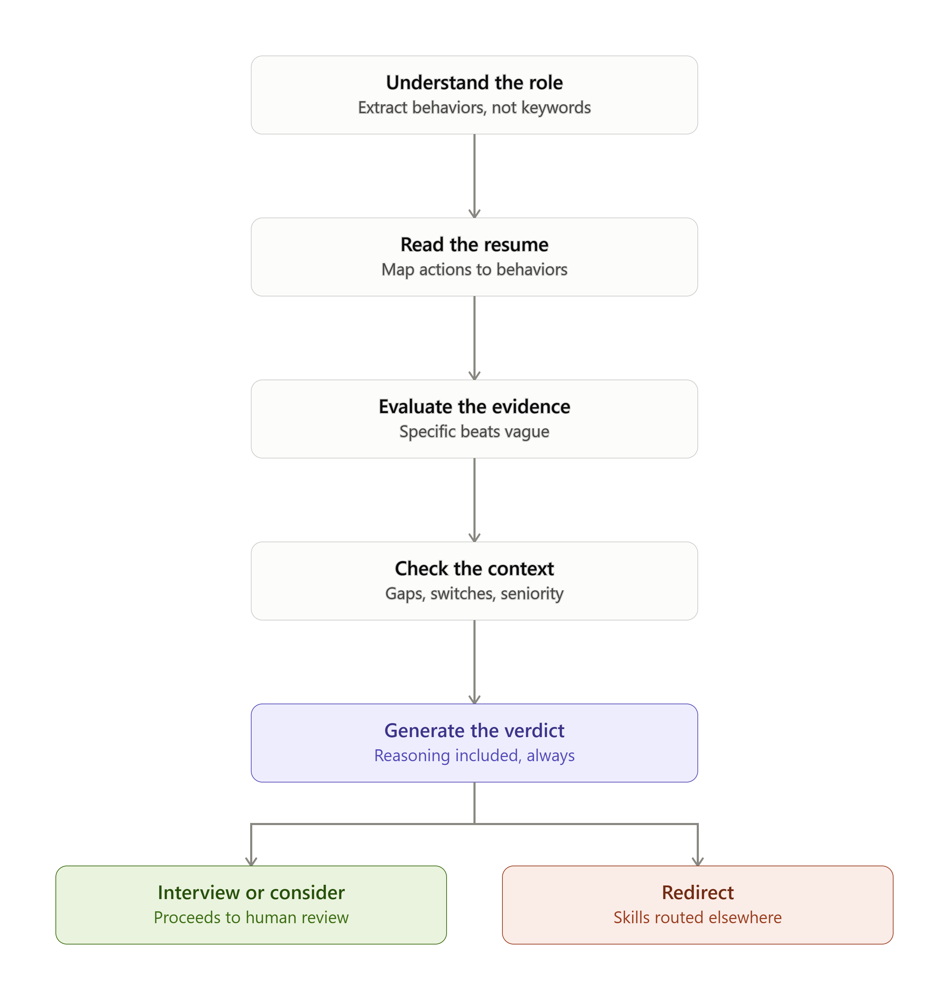

# 🕵️ Evidence-Based Hiring

> **Don't reward hope. Reward evidence.**

## Why this project?

## Prototype Preview

Modern hiring has become increasingly optimized for speed.

ATS platforms and AI tools help recruiters process thousands of resumes, but they often rely heavily on keywords, job titles, and rigid filters.

This prototype explores a different approach.

Instead of asking:

❌ Does the resume contain the right keywords?

It asks:

✅ What evidence demonstrates the behaviours required for this role?

---

## Workflow

The evaluation follows six stages:

1. Understand the role
2. Read the resume
3. Evaluate the evidence
4. Check the context
5. Generate an explainable verdict
6. Interview or Redirect

---

## Current Prototype

Built using:

- HTML
- CSS
- Vanilla JavaScript

The prototype demonstrates how candidate evaluation can become more transparent by explaining **why** a decision is made instead of simply accepting or rejecting an applicant.

---

## Future Roadmap

- AI-assisted evidence extraction
- Resume parsing
- Behaviour mapping
- Explainable hiring decisions
- Internal role redirection
- JSON-driven candidate profiles

---

## Why I built this

This project was inspired by watching candidates struggle with modern hiring systems—not because they lacked ability, but because transferable skills, career gaps, and contextual experience were often reduced to keyword matching.

The goal isn't to replace recruiters.

The goal is to help AI reason more like a human reviewer by evaluating evidence instead of relying solely on keywords.

---

## Contributing

This is an open prototype exploring evidence-based hiring.

Ideas, discussions, issues, and pull requests are welcome.
